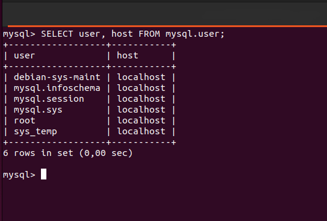
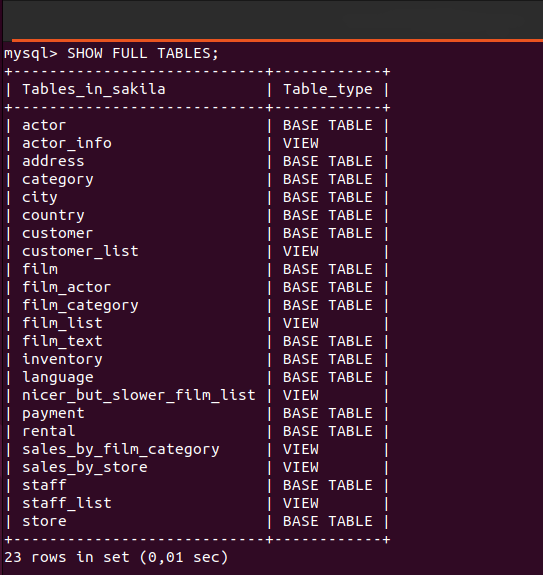
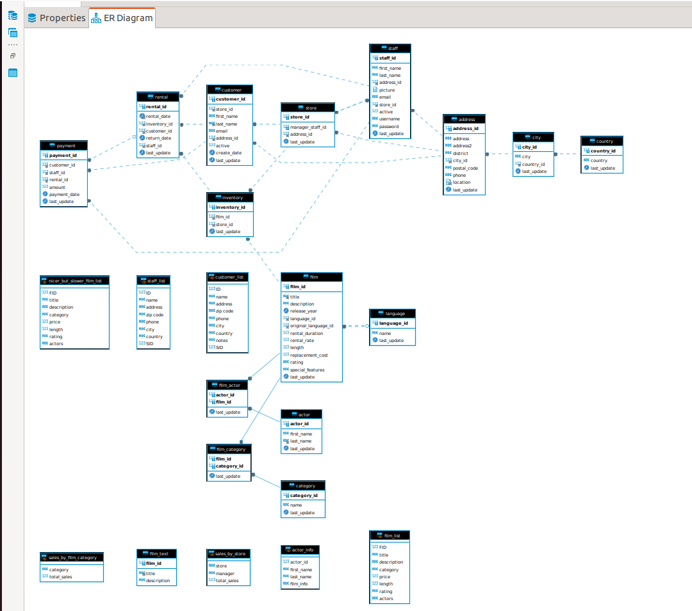

# Домашнее задание к занятию «Работа с данными (DDL/DML)»

### Задание 1
1.1. Поднимите чистый инстанс MySQL версии 8.0+. Можно использовать локальный сервер или контейнер Docker.

1.2. Создайте учётную запись sys_temp. 

```
CREATE USER 'sys_temp'@'localhost' IDENTIFIED BY 'temp';
```

1.3. Выполните запрос на получение списка пользователей в базе данных. (скриншот)



1.4. Дайте все права для пользователя sys_temp. 

```
GRANT ALL PRIVILEGES ON *.* TO 'sys_temp'@'localhost' WITH GRANT OPTION;
FLUSH PRIVILEGES;
```

1.5. Выполните запрос на получение списка прав для пользователя sys_temp. (скриншот)


1.6. Переподключитесь к базе данных от имени sys_temp.

Для смены типа аутентификации с sha2 используйте запрос: 
```sql
ALTER USER 'sys_test'@'localhost' IDENTIFIED WITH mysql_native_password BY 'password';
```
1.6. По ссылке https://downloads.mysql.com/docs/sakila-db.zip скачайте дамп базы данных.

1.7. Восстановите дамп в базу данных.

```
SOURCE /home/lanmiix/sakila-db/sakila-schema.sql
SOURCE /home/lanmiix/sakila-db/sakila-data.sql
```

1.8. При работе в IDE сформируйте ER-диаграмму получившейся базы данных. При работе в командной строке используйте команду для получения всех таблиц базы данных. (скриншот)




*Результатом работы должны быть скриншоты обозначенных заданий, а также простыня со всеми запросами.*


### Задание 2
Составьте таблицу, используя любой текстовый редактор или Excel, в которой должно быть два столбца: в первом должны быть названия таблиц восстановленной базы, во втором названия первичных ключей этих таблиц. Пример: (скриншот/текст)
```
Название таблицы | Название первичного ключа
actor            | actor_id
address          | address_id
category         | category_id
city             | city_id
country          | country_id
customer         | customer_id
film             | film_id
film_actor       | actor_id, film_id
film_category    | film_id, category_id
film_text        | film_id
inventory        | inventory_id
language         | language_id
payment          | payment_id
rental           | rental_id
store            | store_id
staff            | staff_id
```
